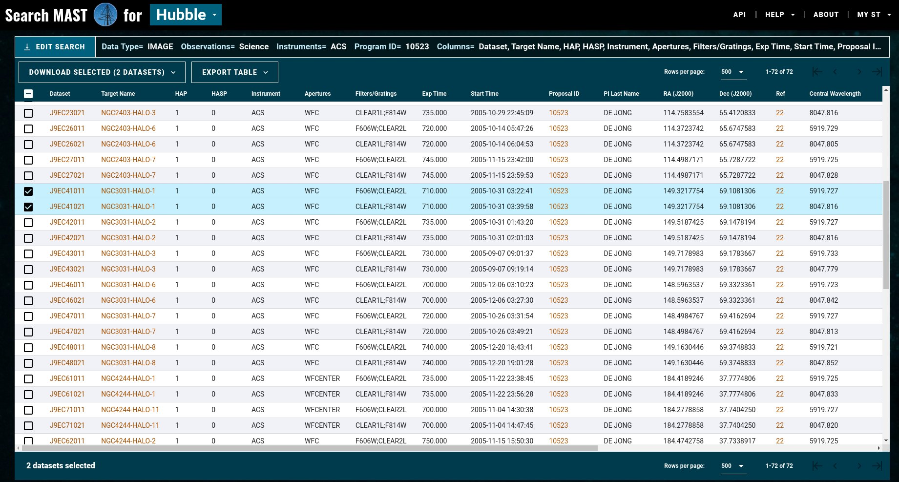

# Modulo II Practica 2: uso de DOLPHOT y caracterizacion de poblaciones estelares.
El presente documento muestra el proceso realizado a lo largo de la practica 2 del modulo de estrellas resueltas y poblaciones estelares. El presente escrito esta organizado de tal manera que sigue los pasos presentados dentro del documento de la practica, detalles o apendices se encuentran al final, y no se espera sean considerados en la evaluacion del trabajo.

En caso de desear revisar en mayor detalle los archivos en si mismos, estan archivados los scripts usados dentro del repositorio de github utilizado por el estudiante para el curso, [Link al repositorio.](https://github.com/Marcoritou/topicos-astronomia/tree/main/practicaDOLPHOT)

El paso 5 presenta los archivos que responden a los puntos de evaluacion entregados en el slide 7 de la practica, mientras que los pasos 1-4 presentan las deducciones, consideraciones y el proceso realizado a lo largo de la practica en si misma.

## Paso 1: Instalacion de DOLPHOT

Aqui se muestran los pasos realizados para instalar DOLPHOT dentro de el sistema operativo linux, con distribucion elelementary OS.

### 1.1: Descarga de DOLPHOT

Los archivos para la compilacion son descargados directamente de la siguiente pagina [http://americano.dolphinsim.com/dolphot/](http://americano.dolphinsim.com/dolphot/), la cual contiene principalmente el software DOLPHOT y el modulo de ACS a utilizar igualmente, tambien estan disponibles las PSFs de ACS al igual que sus Pixel Area Maps(PAMs), se muestran a continuacion los archivos a descargar destacados:

Luego de descargar tanto el codigo a compilar del software como el modulo de ACS, tenemos que conseguir el PAM y las PSFs para ACS.

### 1.2: Descarga de PSFs

Descargar tanto las PSFs como el PAM es posible desde la misma pagina, requerimos 2 PSFs una para cada filtro que utilizaremos, F606W y F814W, se muestran destacados los archivos a descargar a continuacion:

Todos los archivos descargados hasta ahora deberian de estar dentro de la misma raiz de directorio en dolphot2.0.

### 1.3: Instalacion y compilacion de dolphot

Para instalar DOLPHOT, uno comienza primero preparando el archivo Makefile con la configuracion deseada para la maquina en uso, en el caso del trabajo mostrado, se utiliza elementaryOS que esta basado en Ubuntu, que utiliza como compilador el de GCC por lo que se mantiene esa opcion, y se activa la opcion de utilizar el modulo de ACS ya que fue descargado, se muestra el archivo completo de Makefile a continuacion:

~~~
#if your machine uses cc instead of gcc, edit the following:
export CC=gcc
export FC=g77
export MAKE=make

#set the base directory
export BASE_DIR = /home/marcoritou/Documents/PHD_Level3/topicos/practicadolphot/dolphot2.0

#uncomment and set PGPLOT files if installed
#export PGHEAD = \"/usr/local/include/cpgplot.h\"
#export PGPLOT = -L/usr/local/lib -lcpgplot -lpgplot -lpng -L/usr/X11R6/lib -lX11 -L/usr/lib -lgcc

#compilation flags
export CFLAGS= -O3 -Wall -m64

#uncomment if you will be using the WFPC2 module
#export USEWFPC2=1

#uncomment if you will be using the ACS module
export USEACS=1

#uncomment if you will be using the WFC3 module
#export USEWFC3=1

#uncomment if you will be using the ROMAN module
#export USEROMAN=1

#uncomment if you will be using the NIRCAM module
#export USENIRCAM=1

#uncomment if you will be using the NIRISS module
#export USENIRISS=1

#uncomment if you will be using the MIRI module
#export USEMIRI=1

#set the directory where Tiny Tim binaries are located (ACS/WFPC2/WFC3 PSF generation):
#export USETT=1
#export CFLAGS+= -DTTDIR='"/data0/tinytim-7.0"'

#set maximum number of images, and maximum number of stars
export CFLAGS+= -DMAXNIMG=100
export CFLAGS+= -DMAXNSTARS=2000000

#optionally print and/or crash if a NaN occurs (intended for development only)
export CFLAGS+= -DNAN_PRINT
#export CFLAGS+= -DNAN_CRASH

##### NO FURTHER ADJUSTMENTS BELOW THIS LINE ####

#add base directory settings to flags
export CFLAGS += -DBASEDIR='"$(BASE_DIR)"' -I$(BASE_DIR)/include

#definitions
ALLEXE = dolphot_lib.o fits_lib.o fakeproc.o bin/addstars bin/apphot bin/calcsky bin/dolphot bin/synthimg bin/fakelist bin/convertpos
ALL = $(ALLEXE) ccdred
DOLPHOT_DEP = dolphot_lib.o fits_lib.o dolphot_common.h dolphot_defs.h
DOLPHOT_OBJ = dolphot_lib.o fits_lib.o
DOLPHOT_FOBJ =

#linked libraries
export LIBS = -lm

#add WFPC2 modules, if selected
ifdef USEWFPC2
export CFLAGS+= -DUSEWFPC2
ALL+= wfpc2
DOLPHOT_DEP += wfpc2
DOLPHOT_OBJ += wfpc2/wfpc2phot.o wfpc2/wfpc2filters.o wfpc2/wfpc2distort.o
DOLPHOT_FOBJ += wfpc2/wfpc2filters.o
endif

#add ACS modules, if selected
ifdef USEACS
export CFLAGS+= -DUSEACS
ALL+= acs
DOLPHOT_DEP += acs
DOLPHOT_OBJ += acs/acsphot.o acs/acsfilters.o acs/acsdistort.o
DOLPHOT_FOBJ += acs/acsfilters.o
endif

#add WFC3 modules, if selected
ifdef USEWFC3
export CFLAGS+= -DUSEWFC3
ALL+= wfc3
DOLPHOT_DEP += wfc3
DOLPHOT_OBJ += wfc3/wfc3phot.o wfc3/wfc3filters.o wfc3/wfc3distort.o
DOLPHOT_FOBJ += wfc3/wfc3filters.o
endif

#add ROMAN modules, if selected
ifdef USEROMAN
export CFLAGS+= -DUSEROMAN
ALL+= roman
DOLPHOT_DEP += roman
DOLPHOT_OBJ += roman/romanphot.o roman/romanfilters.o roman/romandistort.o
DOLPHOT_FOBJ += roman/romanfilters.o
endif

#add NIRCAM modules, if selected
ifdef USENIRCAM
export CFLAGS+= -DUSENIRCAM
ALL+= nircam
DOLPHOT_DEP += nircam
DOLPHOT_OBJ += nircam/nircamphot.o nircam/nircamfilters.o nircam/nircamdistort.o
DOLPHOT_FOBJ += nircam/nircamfilters.o
endif

#add NIRISS modules, if selected
ifdef USENIRISS
export CFLAGS+= -DUSENIRISS
ALL+= niriss
DOLPHOT_DEP += niriss
DOLPHOT_OBJ += niriss/nirissphot.o niriss/nirissfilters.o niriss/nirissdistort.o
DOLPHOT_FOBJ += niriss/nirissfilters.o
endif

#add MIRI modules, if selected
ifdef USEMIRI
export CFLAGS+= -DUSEMIRI
ALL+= miri
DOLPHOT_DEP += miri
DOLPHOT_OBJ += miri/miriphot.o miri/mirifilters.o miri/miridistort.o
DOLPHOT_FOBJ += miri/mirifilters.o
endif

#add display module, if selected
ifdef PGPLOT
ALL+= display.o
ALLEXE+= display.o
endif

all: $(ALL)

ifdef USEWFPC2
wfpc2::
	cd wfpc2; $(MAKE)
endif

ifdef USEACS
acs::
	cd acs; $(MAKE)
endif

ifdef USEWFC3
wfc3::
	cd wfc3; $(MAKE)
endif

ifdef USEROMAN
roman::
	cd roman; $(MAKE)
endif

ifdef USENIRCAM
nircam::
	cd nircam; $(MAKE)
endif

ifdef USENIRISS
niriss::
	cd niriss; $(MAKE)
endif

ifdef USEMIRI
miri::
	cd miri; $(MAKE)
endif

ccdred::
	cd ccdred; $(MAKE)

dolphot_lib.o: dolphot_lib.c include/dolphot.h
	$(CC) $(CFLAGS) -c -o $@ $<

fits_lib.o: fits_lib.c include/dolphot.h include/fits.h
	$(CC) $(CFLAGS) -c -o $@ $<

bin/addstars: addstars.c $(DOLPHOT_DEP)
	$(CC) $(CFLAGS) -o $@ addstars.c $(DOLPHOT_OBJ) $(LIBS)

bin/convertpos: convertpos.c $(DOLPHOT_DEP)
	$(CC) $(CFLAGS) -o $@ convertpos.c $(DOLPHOT_OBJ) $(LIBS)

ifdef PGPLOT
display.o: display.c dolphot_lib.o fits_lib.o
	$(CC) $(CFLAGS) -c -o $@ $< -DPGHEAD=$(PGHEAD)

bin/apphot: apphot.c dolphot_lib.o fits_lib.o display.o
	$(CC) $(CFLAGS) -c apphot.c -DPGPLOT -DPGHEAD=$(PGHEAD)
	$(FC) -o $@ apphot.o dolphot_lib.o fits_lib.o display.o $(LIBS) $(PGPLOT)
	rm apphot.o

bin/dolphot: dolphot.c $(DOLPHOT_DEP)
	$(CC) $(CFLAGS) -c dolphot.c -DPGPLOT -DPGHEAD=$(PGHEAD)
	$(FC) -o $@ dolphot.o $(DOLPHOT_OBJ) $(LIBS) $(PGPLOT)
	rm dolphot.o
else
bin/apphot: apphot.c dolphot_lib.o fits_lib.o
	$(CC) $(CFLAGS) -o $@ apphot.c dolphot_lib.o fits_lib.o $(LIBS)

bin/dolphot: dolphot.c $(DOLPHOT_DEP)
	$(CC) $(CFLAGS) -o $@ dolphot.c $(DOLPHOT_OBJ) $(LIBS)
endif

bin/calcsky: calcsky.c dolphot_lib.o fits_lib.o
	$(CC) $(CFLAGS) -o $@ calcsky.c dolphot_lib.o fits_lib.o $(LIBS)

bin/synthimg: synthimg.c dolphot_lib.o fits_lib.o
	$(CC) $(CFLAGS) -o $@ synthimg.c dolphot_lib.o fits_lib.o $(LIBS)

bin/fakelist: fakelist.c fakeproc.o fakeproc.h $(DOLPHOT_FOBJ)
	$(CC) $(CFLAGS) -o $@ fakelist.c fakeproc.o $(DOLPHOT_FOBJ) $(LIBS)

clean:
	rm $(ALLEXE)
	cd ccdred ; $(MAKE) clean
ifdef USEWFPC2
	cd wfpc2 ; $(MAKE) clean
endif
ifdef USEACS
	cd acs ; $(MAKE) clean
endif
ifdef USEWFC3
	cd wfc3 ; $(MAKE) clean
endif
ifdef USEROMAN
	cd roman ; $(MAKE) clean
endif
ifdef USENIRCAM
	cd nircam ; $(MAKE) clean
endif
ifdef USENIRISS
	cd niriss ; $(MAKE) clean
endif
ifdef USEMIRI
	cd miri ; $(MAKE) clean
e
~~~

Luego para compilar el codigo de dolphot se utiliza el siguiente comando, dentro del directorio dolphot2.0:

~~~
make
~~~

Luego tenemos que añadir la carpeta generada "bin" a nuestro PATH, esto se puede realizar añadiendo la siguiente linea a nuestro "~/.bashrc":

~~~
export PATH="$PATH:/path/to/dolphot2.0/bin"
~~~

Podemos comprobar la instalacion de manera sencilla con el siguiente comando:

~~~
dolphot
~~~

Lanzara un error declarando que no comprende el archivo fits, pero permite saber que esta funcionando el software.

## Paso 2: Descarga de datos del HST

Esta seccion presentara el proceso de descarga de los datos del HST para NGC 3031.

### 2.1: Busqueda del proposal.

Para descargar los datos del HST podemos entrar en la [pagina de busqueda de datos archivados del HST](https://archive.stsci.edu/hst/search.php), donde se almacenan datos libres de uso de publicaciones pasadas.

Luego dentro de esta pagina de busqueda se coloca el proposalID a buscar, en el caso del presente trabajo se utilizara n los de la GHOSTS survey, entonces se coloca el proposalID "10523".

Luego se les da a buscar los datos, y se buscan especificamente los datos para NGC3031-halo 1, correpondiente al campo 5 del survey de GHOSTS.

### 2.2: Descarga de los datos

Luego dentro de la misma lista de distintas observaciones realizadas, se seleccionan los datos para NGC3031-halo1, para ello seleccionamos la fila correpondiente:

Luego de esto se seleciona descargar datos y seleccionaremos los datos calibrados de antemano, de esa manera tan solo tendremos que maskear los hot pixels y considerar el cielo sin una reduccion de imagenes propia.

### 2.3: Descarga de high level products

Por ultimo se descarga la drizzle image que sera utilizada igualmente, ya que tenemos multiples imagenes en dithering, esto permitira combinarlas todas como una sola imagen a considerar.

La imagen drizzle puede ser descargada de la columna high level products:

Luego seleccionamos la imagen de referencia:

Con esto tenemos un total de 5 archivos, 4 imagenes con 2 de cada filtro y 1 imagen drizzle.

## Paso 3: Aplicacion de DOLPHOT y obtencion de fotometria estelar de las imagenes

Esta seccion detalla el proceso de enmascaramiento de los hot pixels, calculod el cielo, y por ultimo la generacion den catalogo de estrellas con DOLPHOT.

### 3.1: Aplicacion de acsmask

Es necesario considerar que la imagen si bien esta calibrada, y no es necesario realizar una reduccion de la imagen en si, si es necesario el enmascarar los llamados pixeles calientes, estos pixeles son dependientes del instrumento que tenemos en consideracion, ya que en este caso estamos usando imagenes obtenidas con ACS, pues aplicamos la mascara que viene como parte del modulo incluida, con el siguiente comando aplicamos el enmascaramiento sobre un archivo fits:

~~~
acsmask <image.fits>
~~~

Con esto tenemos nuestro archivo fits con los pixeles enmascarados, entonces no seran considerados al generar el catalogo. Igualmente multiplica los pixeles "malos" por el area en pixeles, de esa manera las imagenes estaran en unidades de electrones.

### 3.2: Division de fits por chip

Luego ya que vamos a utilizar una imagen de drizzle para el dithering, tenemos que dividir nuestras 4 imagenes individuales en los 2 chips del ACS, para esto se utiliza el siguiente comando:

~~~
splitgroups <image.fits>
~~~

Con esto tenemos 8 imagenes en total a utilizar, 1 por chip, 2 por filtro, entonces tendremos un total de 4 imagenes en cada filtro que estamos considerando.

### 3.3: Calculo del sky

Es necesario realizar un calculo del cielo en las imagenes, para diferenciar las fuentes de la imagen. Para calcular el cielo de nuestras imagenes, el programa realiza una estimacion basada en un anillo alrededor del pixel en consideracion, de esta manera tenemos que entregar el radio interior y exterior del anillo, al igual que la desviacion que esperamos de una fuente para ser considerado como cielo(el cielo igualmente puede tener un dado brillo).

Para calcular el cielo en una imagen, se utiliza el siguiente comando:

~~~
calcsky <fitsbase> <r_in> <r_out> <step> <sigma_low> <sigma_high>
~~~

En donde los parametros se definen en orden como, radio interior del anillo, radio exterior del anillo, cada cuantos pixeles se toma el anillo de pixeles, en cada iteracion se calcula el promedio y la desviacion estandar, valores por debajo de $\sigma_{low}$ se descartan al igual que aquellos valores por encima de $\sigma_{high}$.

En el caso de ACS, se recomiendan los siguientes parametros:

$r_{in} = 1$ | $r_{out} = 12$ | $step = 1$ | $\sigma_{low}$ | $\sigma_{high}$

### 3.4: Definicion de parametros para DOLPHOT

Finalmente se definen los parametros para dolphot en un archivo de parametros, en caso de no ser definido, se tomaran los valores predeterminados del programa que se encuentran dentro de los archivos del software bajo el directorio param/dolphot.param, entonces nuestro archivo de parametros junto con sus definiciones es tal que:

~~~
Nimg = 8                #number of images (int)
#
# The following parameters can be specified for individual images (img1_...)
#  or applied to all images (img_...)
img1_file = j9ec41afq_flc.chip1
img2_file = j9ec41afq_flc.chip2
img3_file = j9ec41agq_flc.chip1
img4_file = j9ec41agq_flc.chip2
img5_file = j9ec41aiq_flc.chip1
img6_file = j9ec41aiq_flc.chip2
img7_file = j9ec41akq_flc.chip1
img8_file = j9ec41akq_flc.chip2
img_shift = 0 0         #shift relative to reference
img_xform = 1 0 0       #scale, distortion, and rotation
img_PSFa = 3 0 0 0 0 0  #PSF XX term (flt)
img_PSFb = 3 0 0 0 0 0  #PSF YY term (flt)
img_PSFc = 0 0 0 0 0 0  #PSF XY term (flt)
img_RAper = 3         #photometry apeture size (flt)
img_RChi = 2.0           #Aperture for determining centroiding (flt); if <=0 use RAper
img_RSky = 15 35         #radii defining sky annulus (flt>=RAper+0.5)
img_RPSF = 10           #PSF size (int>0)
img_aprad = 20          #radius for aperture correction
img_apsky = 30 50       #sky annulus for aperture correction
#
# The following photometers affect the finding and measurement of stars
photsec =               #section: group, chip, (X,Y)0, (X,Y)1
RCentroid = 1           #centroid box size (int>0)
SigFind = 2.5           #sigma detection threshold (flt)
SigFindMult = 0.85      #Multiple for quick-and-dirty photometry (flt>0)
SigFinal = 3.5          #sigma output threshold (flt)
MaxIT = 25              #maximum iterations (int>0)
FPSF = G+L              #PSF function (str/Gauss,Lorentz,Lorentz^2,G+L)
PSFPhot = 1             #photometry type (int/0=aper,1=psf,2=wtd-psf)
PSFPhotIt = 1           #number of iterations in PSF-fitting photometry (int>=0)
FitSky = 2              #fit sky? (int/0=no,1=yes,2=small,3=with-phot)
SkipSky = 2             #spacing for sky measurement (int>0)
SkySig = 2.25           #sigma clipping for sky (flt>=1)
NegSky = 1              #allow negative sky values? (0=no,1=yes)
NoiseMult = 0.10        #noise multiple in imgadd (flt)
FSat = 0.999            #fraction of saturate limit (flt)
Zero = 25.0             #zeropoint for 1 DN/s (flt)
PosStep = 0.25          #search step for position iterations (flt)
dPosMax = 2.5           #maximum single-step in position iterations (flt)
RCombine = 1.415          #minimum separation for two stars for cleaning (flt)
SigPSF = 3.0             #min S/N for psf parameter fits (flt)
PSFStep = 0.25          #stepsize for PSF
MinS = 1.0              #minimum FWHM for good star (flt)
MaxS = 9.0              #maximum FWHM for good star (flt)
MaxE = 0.5              #maximum ellipticity for good star (flt)
#
# Settings to enable/disable features
UseWCS = 1              #use WCS info in alignment (int 0=no, 1=shift/rotate/scale, 2=full)
Align = 4               #align images? (int 0=no,1=const,2=lin,3=cube)
AlignIter = 1           #number of iterations on alignment? (int>0)
AlignTol = 0            #number of pixels to search in preliminary alignment (flt>=0)
AlignStep = 1           #stepsize for preliminary alignment search (flt>0)
AlignOnly = 0           #exit after alignment
Rotate = 1              #allow cross terms in alignment? (int 0=no, 1=yes)
SubResRef = 1           #subpixel resolution for reference image (int>0)
SecondPass = 5          #second pass finding stars (int 0=no,1=yes)
SearchMode = 1          #algorithm for astrometry (0=max SNR/chi, 1=max SNR)
Force1 = 0              #force type 1/2 (stars)? (int 0=no,1=yes)
EPSF = 1                #allow elliptical PSFs in parameter fits (int 0=no,1=yes)
PSFsol = 1              #Analytic PSF solution (int -1=none, 0=con, 1=lin, 2=quad)
PSFres = 1              #make PSF residual image? (int 0=no,1=yes)
psfstars =              #Coordinates of PSF stars
psfoff = 0.0            #coordinate offset (PSF system - dolphot system)
ApCor = 1               #find/make aperture corrections? (int 0=no,1=yes)
SubPixel = 1            #subpixel PSF calculation (int>0)
FakeStars =             #file with fake star input data
FakeOut =               #file with fake star output data (default=phot.fake)
FakeMatch = 3.0         #maximum separation between input and recovered star (flt>0)
FakePSF = 2.0           #assumed PSF FWHM for fake star matching
FakeStarPSF = 1         #use PSF residuals in fake star tests? (int 0=no,1=yes)
RandomFake = 1          #apply Poisson noise to fake stars? (int 0=no,1=yes)
FakePad = 0             #minimum distance of fake star from any chip edge to be used
UsePhot =               #if defined, use alignment, PSF, and aperture corr from photometry
DiagPlotType =          #format to generate diagnostic plots (PNG, GIF, PS)
xytfile =               #position file for warmstart (str)
xytpsf =                #reference PSF for image subtraction
VerboseData = 0         #to write all displayed numbers to a .data file
#
# Flags for HST modes
ForceSameMag = 0        #force same count rate in images with same filter? (int 0=no, 1=yes)
FlagMask = 4            #photometry quality flags to reject when combining magnitudes
CombineChi = 0          #combined magnitude weights uses chi? (int 0=no, 1=yes)
WFPC2useCTE = 0         #apply CTE corrections on WFPC2 data? (int 0=no, 1=yes)
ACSuseCTE = 0           #apply CTE corrections on ACS data? (int 0=no, 1=yes)
WFC3useCTE = 0          #apply CTE corrections on WFC3 data? (int 0=no, 1=yes)
ACSpsfType = 0          #use Anderson PSF cores? (int 0=no, 1=yes)
WFC3UVISpsfType = 0     #use Anderson PSF cores? (int 0=no, 1=yes)
WFC3IRpsfType = 0       #use Anderson PSF cores? (int 0=no, 1=yes)
InterpPSFlib = 1        #interpolate PSF library spatially
#
# Other flags not recommended for most users
#img_ref2img =          #high order terms for conversion between image (distortion-corrected
~~~

Que replican los valores tomados en [Monachesi et al. 2016](google.com).

### 3.5: Ejecucion de DOLPHOT

Finalmente para ejecutar dolphot sobre las imagenes a partir de nuestro archivo de parametros solo se utiliza el siguiente comando:

~~~
dolphot -p<parametros.param>
~~~
## Paso 4: Analisis del catalogo estelar generado

En esta seccion se detallan los metodos para el analisis del catalogo obtenido, el catalogo se encuentra dentro del , bajo el nombre de catalogo.fits.

### 4.1: Mini revision de conceptos

Es necesario el saber las definiciones explicitas de los valores que DOLPHOT encuentra para los objetos, esto es clave en el analisis para discernir los objetos de interes para analizar poblaciones estelares resueltas.

Dolphot genera multiples archivos al ser ejecutado, uno de estos archivos clave es el ".columns", que detalla que es cada columna del catalogo generado.

#### 4.1.1: Object types

Object type indica la naturaleza de la fuente detectada por DOLPHOT, este valor se extiende desde 1 hasta 5, siendo las definiciones en orden tal que:

- 1 = bright star
- 2 = faint
- 3 = elongated
- 4 = hot pixel
- 5 = extended

En el caso del presente trabajo claramente necesitamos considerar tan solo las estrellas, entonces aquellos elementos del catalogo de objectype 1.

#### 4.1.2: Cull de objetos extendidos

Luego si bien tenemos seleccionados los elementos clasificados como estrellas brillantes, no tenemos un estandar de que tan buena calidad son en si mismos, pero podemos utilizar tanto el sharpness como el crowding para evitar aquellos objetos que puedan ser problematicos en el analisis, como estrellas superpuestas(en las zonas muy densas de estrellas).

Para ello se consideran los limites establecidos por [Radburn-Smith et al. 2011](google.com), los cuales son los siguientes:

The final selection criteria adopted for selecting stars in sparse fields are:

$−0.06 < sharpness_{F606W} + sharpness_{F814W} < 1.30$ (1)

$crowding_{F606W} + crowding_{F814W} < 0.16$ (2)

$S/N_{F606W} > 5.0$ & $S/N_{F814W} > 5.0$ (3)

### 4.2: Correcion de la extincion galactica

Finalmente tenemos que corregir nuestras magnitudes en cada filtro por la extincion galactica, para ello tomamos el valor de extincion en el filtro V de [Monachesi et al. 2016](google.com) y de [Schlafly & Finkbeiner 2011](google.com) tenemos que para F606W y F814W considerando $R_V=3.1$:

$A_{F606W}/E(B-V) = 2.471$ (4) | $A_{F814W}/E(B-V) = 1.526$ (5)

$A_{F606W} = 2.471*E(B-V)$ (5) | $A_{F814W} = 1.526*E(B-V)$ (7)

y la ley de extincion es:

$R_V=A_V/E(B-V)$ (8)

Obtenemos el exceso de color de esta ultima ecuacion:

$E(B-V) = A_V/R_V$ (9)

Entonces claramente podemos reemplazar $E(B-V)$ en las ecuaciones 5 y 7 con 9, para obtener:

$A_{F606W} = 2.471*A_V/R_V$ (10) | $A_{F814W}/E(B-V) = 1.526*A_V/R_V$ (11)

Finalmente reemplazamos, con $A_V=0.19$ obtenido de Monachesi et al. 2016a tabla 1 y $R_V=3.1$ en las ecuaciones 10 y 11:

$A_{F606W} = 2.471*(0.19/3.1)$ (12) | $A_{F814W} = 1.526*(0.19/3.1)$ (13)

Obteniendo asi los valores de la extincion galactica en el caso de nuestro catalogo.

$A_{F606W} = 0.151$ | $A_{F814W} = 0.0935$.

### 4.3: CMD(F606W-F814W vs. F814W) de las estrellas

Finalmente con las magnitudes del catalogo corregidas por la extincion galactica obtenemos el diagrama color-magnitud de las estrellas resueltas en NGC 3031:

### 4.4: Estimacion de la TRGB

Para estimar la magnitud aparente de la TRGB de utiliza el metodo de [Mendez et al. 2003](google.com) basado en la funcion de luminosidad de las estrellas del catalogo, este metodo se basa en el cambio brusco, o mas bien el cambio de la pendiente de la funcion de luminosidad, como marca de la TRGB.

Previo a realizar la funcion de luminosidad limitamos las estrellas a considerar a tan solo aquellas pertenecientes a la rama principal, asi evitamos estrellas de otras etapas evolutivas como enanas blancas. Tomamos las siguientes limitaciones.

- $m_{F606W}-m_{F814W} < -4.8*((m_{F606W}-m_{F814W}))+32$
- $m_{F606W}-m_{F814W} > -4.8*((m_{F606W}-m_{F814W}))+27.5$

Siendo entonces las estrellas a considerar en amarillo en el CMD tal que:

Finalmente entonces la funcion de luminosidad de nuestro catalogo es tal que:

Y luego entonces la gradiente de la funcion de luminosidad, nos dira en que punto de la funcion de luminosidad cambia bruscamente la misma. La gradiente es tal que:

Mostramos el CMD en conjunto con la funcion de luminosidad, para demostrar con mayor claridad el concepto propuesto.
Entonces tomamos el 2do peak de la gradiente como la magnitud aparente de nuestra TRGB.

The second peak then is at an apparent magnitude:

$m_{TRGB} = 23.707_{[mag]}$

So now we just see which star from our catalog most closely resembles the apparent magnitude obtained from our analysis of the luminosity function. As such our TRGB from our catalog has the following properties:

$m_{TRGB} = 23.704_{[mag]}$

$F606W - F814W = 1.53$

And given the color of the TRGB, we can estimate the absolute magnitude:

$M_{F814W} = -4.06 + 0.20 [(F606W - F814W)-1.213$

And using the absolute magnitude and the apparent magnitude of our TRGB we can obtain the distance to NGC3031:

$d=10^{\frac{(m-M)+5}{5}}$

$d=3.468_{[Mpc]}$
### 4.5: Estimacion de $t_j$

Para estimar $t_j$ se toma una region del CMD, para considerar las estrellas que estan en la post-MS, y de las expresiones vistasen clases podemos considerar de la luminosidad total en nuestro campo de vision para calcular $t_j$:

$L_T = BC_{\lambda} \cdot FoV \cdot 10^{−0.4 \cdot (\mu_{\lambda}−A_{\lambda}−(M-m)−M_{\lambda , \odot}})$

Se utiliza $L_T$ luego para calcular $t_j$ tal que:

$N_j = B(t) L_T t_j$

$t_j = \frac{N_j}{B(t) L_T}$

Donde el valor de $B(t)$ es definido segun la edad de la poblacion estelar considerada, sin embargo incluso en amplios rangos de edades varia de manera minima, en este trabajo se asume un valor de $B(t)=1.5$, obteniendo entonces el valor de $L_T$:

$L_T = 5.06$

Entonces seleccionamos una region del CMD que represente una etapa post-MS, contamos la cantidad de estrellas dentro y reemplazamos en la ecuacion de $t_j$, junto con $L_T$ y nuestro valor de $B(t)$. Se muestran entonces las estrellas seleccionadas para el conteo en el CMD:

Entonces finalmente obtenemos la siguiente cantidad de estrellas en la region mostrada del CMD:

$N_j = 848$

Finalmente entregandonos para $t_j$:

$t_j=1.11 \times 10^{6}_{[yrs]}$

### 4.6: Ajuste de isocronas

Finalmente se ajustan isocronas a nuestro CMD obtenido para estimar la edad, en este caso se utiliza un metodo "eyeball", por lo que se consideran distintos rangos de edades y metalicidades, mostrados a continuacion:

## Paso 5: Recopilacion de lo obtenido

Esta seccion recopila lo pedido para la evaluacion del trabajo, el orden de las subsecciones es segun las directivas señalas para la evaluacion.

### 5.A: Makefile

El archivo Makefile es tal que:

~~~
#if your machine uses cc instead of gcc, edit the following:
export CC=gcc
export FC=g77
export MAKE=make

#set the base directory
export BASE_DIR = /home/marcoritou/Documents/PHD_Level3/topicos/practicadolphot/dolphot2.0

#uncomment and set PGPLOT files if installed
#export PGHEAD = \"/usr/local/include/cpgplot.h\"
#export PGPLOT = -L/usr/local/lib -lcpgplot -lpgplot -lpng -L/usr/X11R6/lib -lX11 -L/usr/lib -lgcc

#compilation flags
export CFLAGS= -O3 -Wall -m64

#uncomment if you will be using the WFPC2 module
#export USEWFPC2=1

#uncomment if you will be using the ACS module
export USEACS=1

#uncomment if you will be using the WFC3 module
#export USEWFC3=1

#uncomment if you will be using the ROMAN module
#export USEROMAN=1

#uncomment if you will be using the NIRCAM module
#export USENIRCAM=1

#uncomment if you will be using the NIRISS module
#export USENIRISS=1

#uncomment if you will be using the MIRI module
#export USEMIRI=1

#set the directory where Tiny Tim binaries are located (ACS/WFPC2/WFC3 PSF generation):
#export USETT=1
#export CFLAGS+= -DTTDIR='"/data0/tinytim-7.0"'

#set maximum number of images, and maximum number of stars
export CFLAGS+= -DMAXNIMG=100
export CFLAGS+= -DMAXNSTARS=2000000

#optionally print and/or crash if a NaN occurs (intended for development only)
export CFLAGS+= -DNAN_PRINT
#export CFLAGS+= -DNAN_CRASH

##### NO FURTHER ADJUSTMENTS BELOW THIS LINE ####

#add base directory settings to flags
export CFLAGS += -DBASEDIR='"$(BASE_DIR)"' -I$(BASE_DIR)/include

#definitions
ALLEXE = dolphot_lib.o fits_lib.o fakeproc.o bin/addstars bin/apphot bin/calcsky bin/dolphot bin/synthimg bin/fakelist bin/convertpos
ALL = $(ALLEXE) ccdred
DOLPHOT_DEP = dolphot_lib.o fits_lib.o dolphot_common.h dolphot_defs.h
DOLPHOT_OBJ = dolphot_lib.o fits_lib.o
DOLPHOT_FOBJ =

#linked libraries
export LIBS = -lm

#add WFPC2 modules, if selected
ifdef USEWFPC2
export CFLAGS+= -DUSEWFPC2
ALL+= wfpc2
DOLPHOT_DEP += wfpc2
DOLPHOT_OBJ += wfpc2/wfpc2phot.o wfpc2/wfpc2filters.o wfpc2/wfpc2distort.o
DOLPHOT_FOBJ += wfpc2/wfpc2filters.o
endif

#add ACS modules, if selected
ifdef USEACS
export CFLAGS+= -DUSEACS
ALL+= acs
DOLPHOT_DEP += acs
DOLPHOT_OBJ += acs/acsphot.o acs/acsfilters.o acs/acsdistort.o
DOLPHOT_FOBJ += acs/acsfilters.o
endif

#add WFC3 modules, if selected
ifdef USEWFC3
export CFLAGS+= -DUSEWFC3
ALL+= wfc3
DOLPHOT_DEP += wfc3
DOLPHOT_OBJ += wfc3/wfc3phot.o wfc3/wfc3filters.o wfc3/wfc3distort.o
DOLPHOT_FOBJ += wfc3/wfc3filters.o
endif

#add ROMAN modules, if selected
ifdef USEROMAN
export CFLAGS+= -DUSEROMAN
ALL+= roman
DOLPHOT_DEP += roman
DOLPHOT_OBJ += roman/romanphot.o roman/romanfilters.o roman/romandistort.o
DOLPHOT_FOBJ += roman/romanfilters.o
endif

#add NIRCAM modules, if selected
ifdef USENIRCAM
export CFLAGS+= -DUSENIRCAM
ALL+= nircam
DOLPHOT_DEP += nircam
DOLPHOT_OBJ += nircam/nircamphot.o nircam/nircamfilters.o nircam/nircamdistort.o
DOLPHOT_FOBJ += nircam/nircamfilters.o
endif

#add NIRISS modules, if selected
ifdef USENIRISS
export CFLAGS+= -DUSENIRISS
ALL+= niriss
DOLPHOT_DEP += niriss
DOLPHOT_OBJ += niriss/nirissphot.o niriss/nirissfilters.o niriss/nirissdistort.o
DOLPHOT_FOBJ += niriss/nirissfilters.o
endif

#add MIRI modules, if selected
ifdef USEMIRI
export CFLAGS+= -DUSEMIRI
ALL+= miri
DOLPHOT_DEP += miri
DOLPHOT_OBJ += miri/miriphot.o miri/mirifilters.o miri/miridistort.o
DOLPHOT_FOBJ += miri/mirifilters.o
endif

#add display module, if selected
ifdef PGPLOT
ALL+= display.o
ALLEXE+= display.o
endif

all: $(ALL)

ifdef USEWFPC2
wfpc2::
	cd wfpc2; $(MAKE)
endif

ifdef USEACS
acs::
	cd acs; $(MAKE)
endif

ifdef USEWFC3
wfc3::
	cd wfc3; $(MAKE)
endif

ifdef USEROMAN
roman::
	cd roman; $(MAKE)
endif

ifdef USENIRCAM
nircam::
	cd nircam; $(MAKE)
endif

ifdef USENIRISS
niriss::
	cd niriss; $(MAKE)
endif

ifdef USEMIRI
miri::
	cd miri; $(MAKE)
endif

ccdred::
	cd ccdred; $(MAKE)

dolphot_lib.o: dolphot_lib.c include/dolphot.h
	$(CC) $(CFLAGS) -c -o $@ $<

fits_lib.o: fits_lib.c include/dolphot.h include/fits.h
	$(CC) $(CFLAGS) -c -o $@ $<

bin/addstars: addstars.c $(DOLPHOT_DEP)
	$(CC) $(CFLAGS) -o $@ addstars.c $(DOLPHOT_OBJ) $(LIBS)

bin/convertpos: convertpos.c $(DOLPHOT_DEP)
	$(CC) $(CFLAGS) -o $@ convertpos.c $(DOLPHOT_OBJ) $(LIBS)

ifdef PGPLOT
display.o: display.c dolphot_lib.o fits_lib.o
	$(CC) $(CFLAGS) -c -o $@ $< -DPGHEAD=$(PGHEAD)

bin/apphot: apphot.c dolphot_lib.o fits_lib.o display.o
	$(CC) $(CFLAGS) -c apphot.c -DPGPLOT -DPGHEAD=$(PGHEAD)
	$(FC) -o $@ apphot.o dolphot_lib.o fits_lib.o display.o $(LIBS) $(PGPLOT)
	rm apphot.o

bin/dolphot: dolphot.c $(DOLPHOT_DEP)
	$(CC) $(CFLAGS) -c dolphot.c -DPGPLOT -DPGHEAD=$(PGHEAD)
	$(FC) -o $@ dolphot.o $(DOLPHOT_OBJ) $(LIBS) $(PGPLOT)
	rm dolphot.o
else
bin/apphot: apphot.c dolphot_lib.o fits_lib.o
	$(CC) $(CFLAGS) -o $@ apphot.c dolphot_lib.o fits_lib.o $(LIBS)

bin/dolphot: dolphot.c $(DOLPHOT_DEP)
	$(CC) $(CFLAGS) -o $@ dolphot.c $(DOLPHOT_OBJ) $(LIBS)
endif

bin/calcsky: calcsky.c dolphot_lib.o fits_lib.o
	$(CC) $(CFLAGS) -o $@ calcsky.c dolphot_lib.o fits_lib.o $(LIBS)

bin/synthimg: synthimg.c dolphot_lib.o fits_lib.o
	$(CC) $(CFLAGS) -o $@ synthimg.c dolphot_lib.o fits_lib.o $(LIBS)

bin/fakelist: fakelist.c fakeproc.o fakeproc.h $(DOLPHOT_FOBJ)
	$(CC) $(CFLAGS) -o $@ fakelist.c fakeproc.o $(DOLPHOT_FOBJ) $(LIBS)

clean:
	rm $(ALLEXE)
	cd ccdred ; $(MAKE) clean
ifdef USEWFPC2
	cd wfpc2 ; $(MAKE) clean
endif
ifdef USEACS
	cd acs ; $(MAKE) clean
endif
ifdef USEWFC3
	cd wfc3 ; $(MAKE) clean
endif
ifdef USEROMAN
	cd roman ; $(MAKE) clean
endif
ifdef USENIRCAM
	cd nircam ; $(MAKE) clean
endif
ifdef USENIRISS
	cd niriss ; $(MAKE) clean
endif
ifdef USEMIRI
	cd miri ; $(MAKE) clean
e
~~~
### 5.B: Parametros de DOLPHOT

El archivo de parametros para DOLPHOT replica los valores considerados en [Monachesi et al. 2016]:

~~~
Nimg = 8                #number of images (int)
#
# The following parameters can be specified for individual images (img1_...)
#  or applied to all images (img_...)
img1_file = j9ec41afq_flc.chip1
img2_file = j9ec41afq_flc.chip2
img3_file = j9ec41agq_flc.chip1
img4_file = j9ec41agq_flc.chip2
img5_file = j9ec41aiq_flc.chip1
img6_file = j9ec41aiq_flc.chip2
img7_file = j9ec41akq_flc.chip1
img8_file = j9ec41akq_flc.chip2
img_shift = 0 0         #shift relative to reference
img_xform = 1 0 0       #scale, distortion, and rotation
img_PSFa = 3 0 0 0 0 0  #PSF XX term (flt)
img_PSFb = 3 0 0 0 0 0  #PSF YY term (flt)
img_PSFc = 0 0 0 0 0 0  #PSF XY term (flt)
img_RAper = 3         #photometry apeture size (flt)
img_RChi = 2.0           #Aperture for determining centroiding (flt); if <=0 use RAper
img_RSky = 15 35         #radii defining sky annulus (flt>=RAper+0.5)
img_RPSF = 10           #PSF size (int>0)
img_aprad = 20          #radius for aperture correction
img_apsky = 30 50       #sky annulus for aperture correction
#
# The following photometers affect the finding and measurement of stars
photsec =               #section: group, chip, (X,Y)0, (X,Y)1
RCentroid = 1           #centroid box size (int>0)
SigFind = 2.5           #sigma detection threshold (flt)
SigFindMult = 0.85      #Multiple for quick-and-dirty photometry (flt>0)
SigFinal = 3.5          #sigma output threshold (flt)
MaxIT = 25              #maximum iterations (int>0)
FPSF = G+L              #PSF function (str/Gauss,Lorentz,Lorentz^2,G+L)
PSFPhot = 1             #photometry type (int/0=aper,1=psf,2=wtd-psf)
PSFPhotIt = 1           #number of iterations in PSF-fitting photometry (int>=0)
FitSky = 2              #fit sky? (int/0=no,1=yes,2=small,3=with-phot)
SkipSky = 2             #spacing for sky measurement (int>0)
SkySig = 2.25           #sigma clipping for sky (flt>=1)
NegSky = 1              #allow negative sky values? (0=no,1=yes)
NoiseMult = 0.10        #noise multiple in imgadd (flt)
FSat = 0.999            #fraction of saturate limit (flt)
Zero = 25.0             #zeropoint for 1 DN/s (flt)
PosStep = 0.25          #search step for position iterations (flt)
dPosMax = 2.5           #maximum single-step in position iterations (flt)
RCombine = 1.415          #minimum separation for two stars for cleaning (flt)
SigPSF = 3.0             #min S/N for psf parameter fits (flt)
PSFStep = 0.25          #stepsize for PSF
MinS = 1.0              #minimum FWHM for good star (flt)
MaxS = 9.0              #maximum FWHM for good star (flt)
MaxE = 0.5              #maximum ellipticity for good star (flt)
#
# Settings to enable/disable features
UseWCS = 1              #use WCS info in alignment (int 0=no, 1=shift/rotate/scale, 2=full)
Align = 4               #align images? (int 0=no,1=const,2=lin,3=cube)
AlignIter = 1           #number of iterations on alignment? (int>0)
AlignTol = 0            #number of pixels to search in preliminary alignment (flt>=0)
AlignStep = 1           #stepsize for preliminary alignment search (flt>0)
AlignOnly = 0           #exit after alignment
Rotate = 1              #allow cross terms in alignment? (int 0=no, 1=yes)
SubResRef = 1           #subpixel resolution for reference image (int>0)
SecondPass = 5          #second pass finding stars (int 0=no,1=yes)
SearchMode = 1          #algorithm for astrometry (0=max SNR/chi, 1=max SNR)
Force1 = 0              #force type 1/2 (stars)? (int 0=no,1=yes)
EPSF = 1                #allow elliptical PSFs in parameter fits (int 0=no,1=yes)
PSFsol = 1              #Analytic PSF solution (int -1=none, 0=con, 1=lin, 2=quad)
PSFres = 1              #make PSF residual image? (int 0=no,1=yes)
psfstars =              #Coordinates of PSF stars
psfoff = 0.0            #coordinate offset (PSF system - dolphot system)
ApCor = 1               #find/make aperture corrections? (int 0=no,1=yes)
SubPixel = 1            #subpixel PSF calculation (int>0)
FakeStars =             #file with fake star input data
FakeOut =               #file with fake star output data (default=phot.fake)
FakeMatch = 3.0         #maximum separation between input and recovered star (flt>0)
FakePSF = 2.0           #assumed PSF FWHM for fake star matching
FakeStarPSF = 1         #use PSF residuals in fake star tests? (int 0=no,1=yes)
RandomFake = 1          #apply Poisson noise to fake stars? (int 0=no,1=yes)
FakePad = 0             #minimum distance of fake star from any chip edge to be used
UsePhot =               #if defined, use alignment, PSF, and aperture corr from photometry
DiagPlotType =          #format to generate diagnostic plots (PNG, GIF, PS)
xytfile =               #position file for warmstart (str)
xytpsf =                #reference PSF for image subtraction
VerboseData = 0         #to write all displayed numbers to a .data file
#
# Flags for HST modes
ForceSameMag = 0        #force same count rate in images with same filter? (int 0=no, 1=yes)
FlagMask = 4            #photometry quality flags to reject when combining magnitudes
CombineChi = 0          #combined magnitude weights uses chi? (int 0=no, 1=yes)
WFPC2useCTE = 0         #apply CTE corrections on WFPC2 data? (int 0=no, 1=yes)
ACSuseCTE = 0           #apply CTE corrections on ACS data? (int 0=no, 1=yes)
WFC3useCTE = 0          #apply CTE corrections on WFC3 data? (int 0=no, 1=yes)
ACSpsfType = 0          #use Anderson PSF cores? (int 0=no, 1=yes)
WFC3UVISpsfType = 0     #use Anderson PSF cores? (int 0=no, 1=yes)
WFC3IRpsfType = 0       #use Anderson PSF cores? (int 0=no, 1=yes)
InterpPSFlib = 1        #interpolate PSF library spatially
#
# Other flags not recommended for most users
#img_ref2img =          #high order terms for conversion between image (distortion-corrected
~~~

### 5.C: CMD con isocrona ajustada

CMD del catalogo junto con isocrona final considerada:

### 5.D: Valores estimados de la magnitud de la TRGB y $t_j$

Se estimo que la magnitud aparente de la TRGB es:

$m_{TRGB} = 23$

entregando asi una distancia de:

$d=3.24_{Mpc}$

Finalmente se obtuvo:

$t_j=13_{Gyrs}$

### 5.E: Imagen en banda F606W con estrellas superpuestas

Imagen en banda F606W con las estrellas indicada en circulos amarillos.

### 5.F: Discusion: Poblaciones encontradas, completitud y crowding

Tomando en consideracion los resultados obtenidos, se estima que NGC3031 tiene una edad estimada de ~10Gyrs con una metalicidad de $[Fe/H]=121$, si bien se consideraron los efectos que podria tener el crowding, el tamaño de pixel considerado aun asi puede ocultar multiples estrellas bajo un mismo pixel. Aun asi el trabajo presentado a tomado los parametros para considerar estrellas resueltas de calidad estipulados en [Radburn-Smith et al. 2011](google.com).

En cuanto a completitud la magnitud aparente mas tenue del catalogo utilizado en el CMD es $m_{min}=20$, que en el caso de NGC3031, el cual se encuentra a una distancia estimada en el documento de $d=3.24Mpc$, supone una magnitud absoluta alcanzada de $M_min=-15$, dejando asi igualmente las estrellas mas debiles del sistema fuera del analisis. Sabiendo entonces que son las estrellas de menor masa las que contribuyen la mayoria del brillo en las galaxias, esto es una limitacion del estudio presentado.

Aun asi el ejercicio realizado demuestra como con datos ya presentes y publicos en astronomia es posible realizar evaluaciones concretas de sistemas de estrellas resueltas en el universo, todo realizado con herramientas, datos y metodos publicamente disponibles en la web.

## Apendice
Seccion de figuras o topicos extra no mencionados en el trabajo.

Aqui se señalan elementos extras realizados durante el desarrollo de la practica, no fueron colocados como parte del cuerpo principal, ya que no responden a especificos puntos de la evaluacion.
